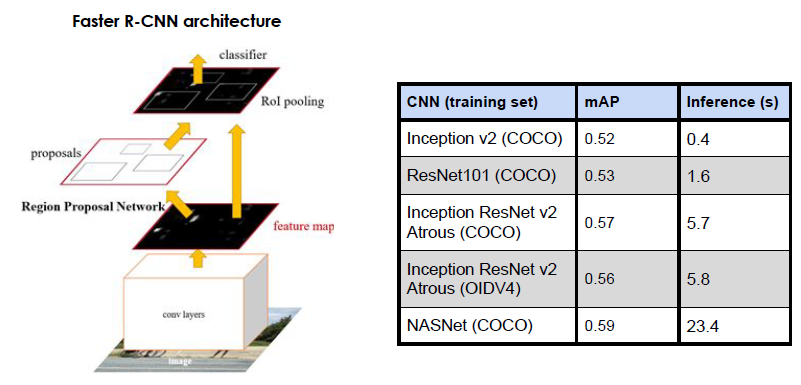

# Happy Walrus - A computer vision app that helps parents identify and mitigate kitchen hazards

Happy Walrus is an easy-to-use babyproofing app that highlights common kitchen hazards in user-provided images. It suggests measures that caregivers can employ to remediate potential dangers, with the aim of reducing the rate of childhood injury in children ages 0-4. 

This container contains only the files that were part of the training and evaluation of the modelos that power the Happy Walrus application. The image below links to the demo presentation of the Happy Walrus app.

## Application

### Mission

To help parents and caregivers make their homes safe for babies and toddlers.
Problem statement and impact.

Parents need simple tools to help babyproof their homes. Unintentional injuries involving children ages 0-4 give rise to over 1.4 million emergency department visits each year in the US. Moreover, most unintentional injuries for children ages 5 and younger occur at home.

Happy Walrus is quick, easy-to-use, and highlights common kitchen hazards in users’ own homes that account for some of the leading causes of injury. In contrast, currently available apps are cumbersome checklists that overwhelmed parents may not have the time or inclination to follow.

### Impact

We anticipate that Happy Walrus will:
- Reduce unintentional injury rates among children ages 0-4 in users’ households
- Make parents and caregivers feel their children are safer (as measured on a Likert scale), and 
- Reduce the amount of time spent assessing hazards prior to undertaking proactive measures to babyproof a home.

## Models

### Data acquisition and annotation pipeline

The process for obtaining annotated images to train the models that power Happy Walrus is described in the following diagram.

### Performance metric

We selected Meann Average Precission (mAP) as performance metric to account for the object detector's model's dual functions to:
1. Localize objects with as tight a bounding box as possible, and
2. Correctly classify objects

Furthermore, mAP balances false positives against false negatives -all things being equal, a larger mAP (closer to 1) indicates a better performance.

### Model selection

To train the app's underlying models, we selected a Faster R-CNN detection pipeline with a different network architectures using TensorFlow Object Detection API in Docker to quickly experiment with these different configurations.

Faster R-CNN with a ResNet101 feature extractos gave the best combination of mAP and inference time.

Finally, we experimented with different augmentations sets, finding Google Brain's suggestion to yield the greatest increase in performance.

Of the 10 objects annotated, the selected has different levels of performance for different objects, being stoves the object that is better detected and outlets (which are very small features) not easily detected.

### Future improvements

In the future, the models that power Happy Walrus could be further improved to, 
- Increase dataset’s breadth (more search terms) and depth (more images per search term)
- Annotate additional classes
- Highlight easy-to-reach objects
- Expand to address other rooms
- Incorporate user feedback on model’s performance
- Package as mobile app (works on mobile web right now!)